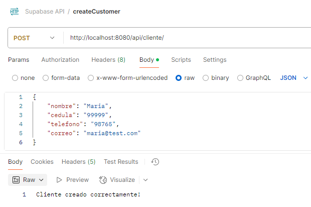

### Crear empleado

```http
  POST /api/empleado/
```
| Parameter | Type     | Description                       |
| :-------- | :------- | :-------------------------------- |
| `nombre`      | `string` | **Required**. Nombre del empleado |
| `cargo`      | `string` | **Required**. Cargo del empleado |
| `telefono`      | `string` | **Required**. Telefono del empleado |


### Crear cliente

```http
  POST /api/cliente/
```
| Parameter | Type     | Description                       |
| :-------- | :------- | :-------------------------------- |
| `nombre`      | `string` | **Required**. Nombre del cliente |
| `cedula`      | `string` | **Required**. Identificacion del cliente |
| `telefono`      | `string` | **Required**. Telefono del cliente |
| `correo`      | `string` | **Required**. Correo del cliente |



### Crear proveedor

```http
  POST /api/proveedor/
```
| Parameter | Type     | Description                       |
| :-------- | :------- | :-------------------------------- |
| `nombre`      | `string` | **Required**. Nombre del proveedor |
| `direccion`      | `string` | **Required**. Direccion del proveedor |
| `telefono`      | `string` | **Required**. Telefono del proveedor |
| `correo`      | `string` | **Required**. Correo del proveedor |


### Crear producto

```http
  POST /api/producto/
```
| Parameter | Type     | Description                       |
| :-------- | :------- | :-------------------------------- |
| `nombre`      | `string` | **Required**. Nombre del producto |
| `descripcion`      | `string` | **Required**. Descripcion del producto |
| `precio`      | `double` | **Required**. Precio del producto |
| `stock`      | `int` | **Required**. Stock |
| `proveedor`      | `Proveedor` | **Required**. Referencia proveedor |


### Crear venta

```http
  POST /api/venta/
```
| Parameter | Type     | Description                       |
| :-------- | :------- | :-------------------------------- |
| `cliente`      | `Cliente` | **Required**. Referencia cliente |
| `empleado`      | `Empleado` | **Required**. Referencia empleado |


### Crear detalle de venta

```http
  POST /api/detalle/
```
| Parameter | Type     | Description                       |
| :-------- | :------- | :-------------------------------- |
| `cantidad`      | `int` | **Required**. Cantidad de productos |
| `precioUnitario`      | `double` | **Required**. Precio unitario del producto |
| `producto`      | `Producto` | **Required**. Referencia producto |
| `venta`      | `Venta` | **Required**. Referencia venta |


### Obtener los detalles de venta por cliente y empleado

```http
  GET /api/detalle/byEmployeeAndCustomer?idEmployee=${id}&idCustomer=${id}
```

#### Repositorio Spring Boot


#### Postman


### Obtener productos que ofrece un proveedor

```http
  GET /api/producto/getBySupplier?idSupplier=${id}
```

#### Repositorio Spring Boot


#### Postman


### Obtener ventas por cliente

```http
  GET /api/venta/getByCustomer?idCustomer=${id}
```

#### Repositorio Spring Boot


#### Postman


### Obtener ventas por empleado

```http
  GET /api/venta/getByEmployee?idEmployee=${id}
```

#### Repositorio Spring Boot


#### Postman


